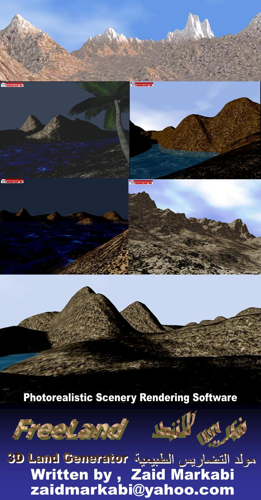



## Free Land

### Description

3D Photorealistic Scenery Rendering Software, FreeLand can be used to generate 3D terrain and landscape.

When you have clear picture .. you have FreeLand.

see screenshot and get it now..

Em@il : zaidmarkabi@yahoo.com

I hope to hear from you soon ,

Zaid Markabi.
 
### More Info
 

             |
---                |---
**Submitted On**   |2008-09-28 13:51:00
**By**             |[Zaid Markabi](https://github.com/Planet-Source-Code/PSCIndex/blob/master/ByAuthor/zaid-markabi.md)
**Level**          |Advanced
**User Rating**    |4.5 (36 globes from 8 users)
**Compatibility**  |VB 5\.0, VB 6\.0
**Category**       |[Complete Applications](https://github.com/Planet-Source-Code/PSCIndex/blob/master/ByCategory/complete-applications__1-27.md)
**World**          |[Visual Basic](https://github.com/Planet-Source-Code/PSCIndex/blob/master/ByWorld/visual-basic.md)
**Archive File**   |[Free\_Land2129099302008\.zip](https://github.com/Planet-Source-Code/zaid-markabi-free-land__1-71166/archive/master.zip)

